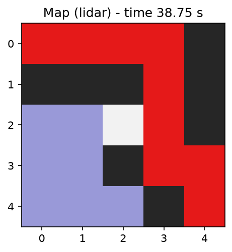
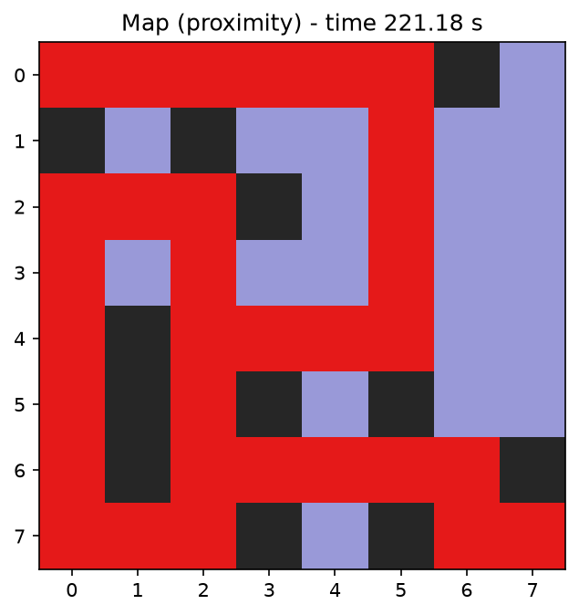
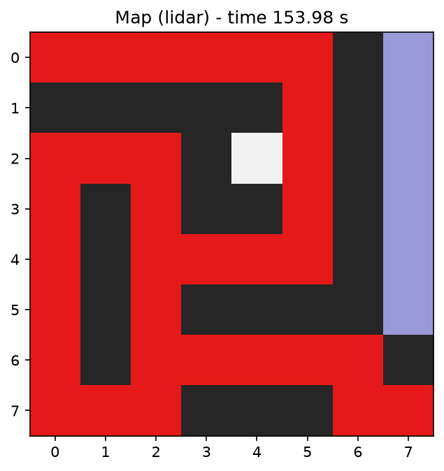

<div align="center">

# csck505-group-project

**Behaviour-based map-building robot — a Micromouse that explores an unknown maze and draws the map.**

<p>
  
  
  
</p>

Worlds, controllers, and pure-Python maze logic for the CSCK505 End-of-Module
group assignment, built with [Webots](https://cyberbotics.com/).

</div>

---

## Contents

| Experiment | What it does | Sensor |
| --- | --- | --- |
| [LiDAR map builder](#lidar-map-builder) | Senses all four sides from each cell and explores depth-first | 360° LiDAR |
| [IR probe-and-map](#ir-probe-and-map) | Discovers walls by bumping into them (short-range only) | IR proximity |
| [The two mazes](#the-two-mazes) | A 5×5 demo maze and an 8×8 stress-test maze | — |

An e-puck starts at `S` facing east and must reach `F`, building a binary map as
it goes: `1` = wall, `0` = free, `?` = never sensed, with the travelled path in
red. The same controller runs both experiments — only the sensor changes — so
the maps are a direct comparison of what each sensor can and cannot see.

---

## LiDAR map builder

> `worlds/maze_world.wbt` · `SENSOR_NAME = "lidar"`

A 180-ray, 360° LiDAR reads the wall on each of the four sides from the cell
centre, so the robot can decide before it moves. It explores by a
**depth-first search**: at each cell it takes the first *open, unvisited*
neighbour in the priority order **straight → right → left → back**, and when a
branch is exhausted it backtracks one cell along its path stack. This always
terminates and reaches the goal if it is reachable — it cannot circle forever.

<div align="center">
  
</div>

The LiDAR sees every wall it passes, so its map is dense: each visited cell
contributes all four of its neighbours.

---

## IR probe-and-map

> `worlds/maze_world.wbt` · `SENSOR_NAME = "proximity"`

The e-puck's eight infra-red sensors only respond within a few centimetres, so
from a cell centre they **cannot see a wall a full cell away**. Instead of
sensing then deciding, the robot *probes*: it tries to move in priority order
and treats a front bump as a wall — driving forward, and if the IR spikes,
stopping, reversing to the cell centre, and marking that neighbour blocked. The
search is the same depth-first backtracking rule.

<div align="center">
  
</div>

Because only *bumped* walls are recorded, the IR map is deliberately **sparser**
than the LiDAR's — an honest picture of a short-range sensor, and the point of
the comparison.

---

## The two mazes

Both are 0.25 m-square cells with 0.10 m walls; the e-puck starts on the green
`S` marker facing east and finishes on the red `F`. Each maze layout and its
grid-to-world geometry live in one module (`layouts/maze.py`,
`layouts/maze_complex.py`) that the world file is built to match.

| Maze | Size | Notes |
| --- | --- | --- |
| `maze_world.wbt` | 5×5 | Original demo maze; short, direct route |
| `maze_world_complex.wbt` | 8×8 | Stress test: a long serpentine with a dead-end trap that forces backtracking |

<div align="center">
  
</div>

**Results** — both sensors solve both mazes (reload the world before each run):

| World | Sensor | Reached goal | Cell steps | Simulated time |
| --- | --- | :---: | :---: | ---: |
| 5×5 | LiDAR | ✅ | 8 | 38.8 s |
| 5×5 | IR probe | ✅ | 8 | 52.4 s |
| 8×8 complex | LiDAR | ✅ | 32 | 154.0 s |
| 8×8 complex | IR probe | ✅ | 32 | 221.2 s |

IR takes longer for the same route because every wall it maps costs a
nose-in-and-reverse probe.

---

## How the robot works

Four layers, from the wheels up:

| Layer | Approach |
| --- | --- |
| **Localisation** | Wheel-encoder distance for one-cell moves; **absolute IMU heading** — turns rotate to the exact cardinal yaw (referenced at startup) rather than a relative 90°, so heading error never accumulates; straight moves hold that heading with a proportional correction |
| **Perception** | LiDAR reduced to four cardinal walls (min range per ±15° sector against a threshold), or IR reduced to a front-bump probe — both behind one `WallSensor` interface |
| **Planning** | Depth-first search with a backtrack stack, expanding by the priority rule straight → right → left → back; guaranteed to terminate and to reach a reachable goal |
| **Mapping** | Incremental `0/1/?` occupancy grid plus the travelled path, dumped to JSON/TXT and rendered to a red-path PNG |

The maze logic is **pure Python with no Webots imports**, so it is unit-tested
against fake robots and mazes without the simulator (`uv run pytest`, 35 tests).
Only the thin driver and sensor wrappers touch the Webots `controller` module.

---

## Getting started

### Prerequisites

- **[Webots](https://cyberbotics.com/)** — R2025a, installed at
  `/Applications/Webots.app` on macOS.
- **[uv](https://docs.astral.sh/uv/)** — `brew install uv`.

```bash
uv sync          # everything, including pytest
uv sync --no-dev # runtime only
```

### Pointing Webots at the uv environment

The `controller` module is provided by Webots itself; it is **not** a pip
package. For controllers to also see this project's package, Webots must run
them with **this project's** Python interpreter.

**Webots → Settings → General → Python command:**

```bash
<path-to-this-repo>/.venv/bin/python
```

### Running an experiment

Open `micromouse.py` and set `SENSOR_NAME` to `"lidar"` or `"proximity"`, then
run headless (the controller stops itself when exploration ends):

```bash
# 5x5 maze
/Applications/Webots.app/Contents/MacOS/webots --batch --minimize \
    --no-rendering --mode=fast --stdout --stderr worlds/maze_world.wbt

# 8x8 stress-test maze
/Applications/Webots.app/Contents/MacOS/webots --batch --minimize \
    --no-rendering --mode=fast --stdout --stderr worlds/maze_world_complex.wbt
```

Each run prints the map and writes `map_<sensor>.json` / `map_<sensor>.txt`
beside the controller. Render the coloured map with:

```bash
uv run render-map controllers/micromouse/map_lidar.json map.png
```

The maze is chosen by the robot's Webots `controllerArgs` (`maze` by default,
`maze_complex` in the complex world), so both worlds share the one controller.

### Tests

The maze logic never imports the Webots `controller` module, so all of it runs
under plain pytest — no simulator needed.

```bash
uv run pytest
```
